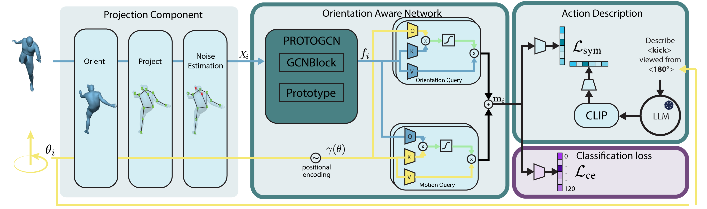

# OrientationAware-HAR

<div align="center">
 <br>
Our method leverages motion cues of multiple camera viewpoints and textual descriptions of human actions in the training phase to handle geometric domain gaps between the training and test sets. <br><br>
</div>

## Table of Contents
- [Introduction](#introduction)
- [Installation](#installation)
- [Usage](#usage)
- [Citation](#citation)
- [Acknowledgements](#acknowledgements)

## Introduction

This is the repository that contains source code for the paper "Cross-Domain Human Action Recognition from Multiview Motion and Textual Descriptions"

The paper is accepted to ICPR 2026.

**Abstract**:
> Robustness to domain changes is a key capability for effective deployment of human action recognition systems in real-world scenarios, where action categories at inference can present important domain shifts or even unseen actions from training. In this context, improving the recognition capabilities of Zero-Shot Action Recognition models (ZSAR), without requiring strong annotation efforts, remains a central challenge. Most ZSAR approaches assume that actions are observed under geometric conditions similar to those seen during training. In practice, variations in human body orientation and camera viewpoint add a significant domain gap in ZSAR, substantially limiting generalization to novel action?motion combinations. In this context, this paper presents a novel orientation-aware action recognition approach with improved cross-domain capabilities. Our approach combines motion cues of multiple camera viewpoints and text descriptions of human actions in the training phase. We present a new orientation-aware motion encoding network to learn different motion features, and adapt a specific orientation-aware text prompt to match the corresponding features at inference. Extensive experiments demonstrate that the proposed method consistently improves ZSAR performance across different recognition benchmarks, outperforming recent state-of-the-art zero-shot approaches on NTU-RGB+D, BABEL, NW-UCLA, and on two surveillance datasets. In addition, the learned representations exhibit strong transfer learning capabilities, yielding competitive performance on both cross-domain and same-domain recognition of seen actions.

## Installation

```shell
pip install -r requirements.txt
```

## Usage

### Checkpoints

Download the provided checkpoints from [here](checkpoints/README.md).
### Data

### Test

To test SAME_DOMAIN or ZSL, run the test with the config and checkpoint from the same folder.

```shell
python test.py checkpoints/ntu60/CROSS_DOMAIN/config.yaml checkpoints/ntu60/CROSS_DOMAIN/zsl.pth
```

To test ZSCD, run the chosen config from a CROSS_DOMAIN folder with the checkpoint from a SAME_DOMAIN folder.

```shell
python test.py checkpoints/ntu60/CROSS_DOMAIN/config.yaml checkpoints/babel_120/SAME_DOMAIN/best.pth
```

### Test Multi View Inference
```shell
python test_multi_view.py checkpoints/ntu60/CROSS_DOMAIN/config.yaml checkpoints/ntu60/CROSS_DOMAIN/zsl.pth --name=testset_mv
```

## Citation
If you find this code and dataset useful for your research, please cite the paper:

```bibtex
```


## Acknowledgements
This work was partially supported by grants from projects ANER MOVIS from ``Conseil Regional de Bourgogne-Franche-Comte'' and ANR MANYVIS (ANR-23-CE23-0003-01), to whom we are grateful.

**ICB:** [Laboratoire Interdisciplinaire Carnot de Bourgogne](https://icb.u-bourgogne.fr/)

